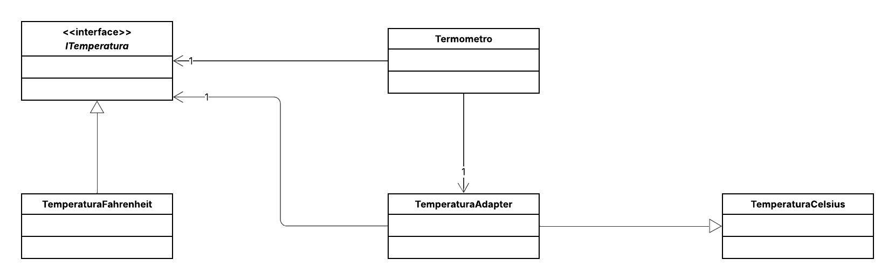

## 🌡️ Sistema de Conversão de Temperatura

Este projeto implementa o padrão de projeto estrutural **Adapter**.
O objetivo é permitir que um sistema cliente (que espera trabalhar com a escala Fahrenheit) utilize uma classe existente (o Adaptee) que só fornece dados e métodos na escala Celsius.

-----

## 📌 Diagrama de Classes

-----

## 👩‍💻 Autora

**Eduarda Araujo Carvalho**
